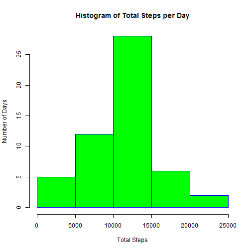
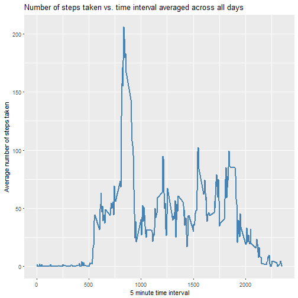
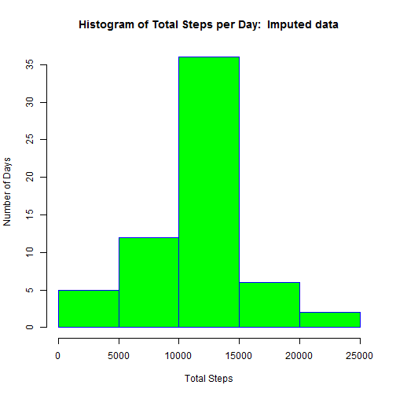
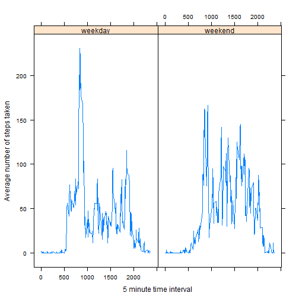

# Reproducible Research: Peer Assessment 1
### John Bracken
### August 22, 2017


## Loading and preprocessing the data

This section will include the code necessary for loading the data into a data frame and also
processing the columns of the data frame into their appropriate formats for the assignment.
Three libraries are also needed; *ggplot2* and *lattice* for plotting and *timeDate* for
manipulating date data.

The libraries are loaded here.

```r
library(ggplot2)
library(timeDate)
library(lattice)
```

The data is loaded into a data frame and the date column is changed to the *Date* format.

```r
activity_data <- read.csv("activity.csv")
activity_data$date <- as.Date(activity_data$date, format = "%Y-%m-%d")
```


## What is the mean total number of steps taken per day?

In this section, the total number of steps taken per day is determined and a histogram
of the total number of steps taken each day is generated and plotted.  Also, from the
activity data frame, the mean and median of the total number of steps taken per day are calculated and printed.

Calculate the total number of steps taken per day, ignoring NA values.

```r
steptotal_by_day<- aggregate(activity_data$steps~activity_data$date, activity_data,sum, na.rm = TRUE)
colnames(steptotal_by_day) <- c("Date","Total steps")
```

Create a histogram of the total number of steps taken per day.

```r
histogram_activity <- hist(steptotal_by_day$`Total steps`, 
                  main = "Histogram of Total Steps per Day",
                  xlab = "Total Steps",
                  ylab = "Number of Days",
                  border = "blue",
                  col = "green",
                  breaks = 6)
```



Calculate and print the mean and median total number of steps taken per day.

```r
mean_steps <- round(mean(steptotal_by_day$`Total steps`),1)
median_steps <-median(steptotal_by_day$`Total steps`)
cat("Mean number of steps:  ", mean_steps, "\n")
```

```
## Mean number of steps:   10766.2
```

```r
cat("Median number of steps:  ", median_steps, "\n")
```

```
## Median number of steps:   10765
```


## What is the average daily activity pattern?

This section calculates the average number of steps taken for each 5-minute time
interval throughout the day, averaged over all dates. This average step activity is then
plotted versus time interval on a line plot.  The time interval during the day in which the maximum average 
number of steps taken occurred is also determined and printed.  The total number of steps is calculated 
for each date before calculating the average.

Calculate total steps taken for each time interval and each date first.

```r
totalsteps_per_interval <- aggregate(activity_data$steps~activity_data$date+activity_data$interval, 
                                     activity_data,sum, na.rm = TRUE)
colnames(totalsteps_per_interval) <- c("Date", "Interval", "Total Steps")
```


Calculate the average number of steps taken for each time interval.

```r
average_interval <- aggregate(totalsteps_per_interval$'Total Steps'~totalsteps_per_interval$Interval, 
                              totalsteps_per_interval,mean)
colnames(average_interval) <- c("Interval", "MeanSteps")
```

Make a plot of the average number of steps taken for each time interval.

```r
timeplot <- ggplot(average_interval, aes(Interval, MeanSteps))
timeplot <- timeplot + geom_line(color = "steelblue",size=1) + 
          labs(title = "Number of steps taken vs. time interval averaged across all days") +
          labs(x = "5 minute time interval", y="Average number of steps taken")
print(timeplot)
```



Get and print the 5 minute time interval where the maximum average number of steps was taken.

```r
max_time <-average_interval[which.max(average_interval$MeanSteps),]
max_interval <-max_time$Interval
cat("Time interval with the maximum number of average steps:  ", max_interval, "\n")
```

```
## Time interval with the maximum number of average steps:   835
```


## Imputing missing values

This section will repeat the histogram, mean and median calculations of the second section,
but using an imputed dataset instead.  The imputation will be done by replacing NAs with
the average number of steps taken for the appropriate time interval, which was already
calculated in the third section above.

Determine and print the total number of NAs in the original data.

```r
total_NAs <- sum(is.na(activity_data$steps))
cat("Total number of missing entries:  ", total_NAs, "\n")
```

```
## Total number of missing entries:   2304
```

Impute the missing data using the average number of steps taken for each time interval.

```r
imputed_data <- activity_data
imputed_data$steps <- as.numeric(imputed_data$steps)
imputed_data <- replace(imputed_data, is.na(imputed_data), average_interval$MeanSteps)
```

Calculate the total number of steps taken per day for the imputed data.

```r
steptotal_by_day_imputed<- aggregate(imputed_data$steps~imputed_data$date, imputed_data, sum)
colnames(steptotal_by_day_imputed) <- c("Date","Total steps")
```

Create a histogram of total number of steps taken for the imputed data.

```r
histogram_imputed <- hist(steptotal_by_day_imputed$`Total steps`, 
                           main = "Histogram of Total Steps per Day:  Imputed data",
                           xlab = "Total Steps",
                           ylab = "Number of Days",
                           border = "blue",
                           col = "green",
                           breaks = 6)
```



Calculate and print the mean and median of the total number of steps taken per day for
the imputed data.

```r
mean_steps_imputed <- round(mean(steptotal_by_day_imputed$`Total steps`),1)
median_steps_imputed <-median(steptotal_by_day_imputed$`Total steps`)
cat("Mean number of steps for imputed data:  ", mean_steps_imputed, "\n")
```

```
## Mean number of steps for imputed data:   10766.2
```

```r
cat("Median number of steps for imputed data:  ", median_steps_imputed, "\n")
```

```
## Median number of steps for imputed data:   10766.19
```

From these results, imputing data had the effect of increasing the number of total
steps taken that fall in the middle bin of the histogram.  Imputing the data didn't really
change the mean total number of steps taken, but it did result in a slight increase in
the median total number of steps taken.  As a result of imputation, the total number of steps taken 
was increased to the mean value for the days that were missing data before.


## Are there differences in activity patterns between weekdays and weekends?

This section repeats the evaluation of the third section, but it separates the average activity patterns over 
all daily time intervals into weekdays versus the weekend.

Add another column to the imputed data that is a logical vector to determine if the day is a weekday or not.
Convert that logical column to a factor specifying whether or not the day is a weekday or a weekend day.

```r
imputed_data$DayType <- isWeekday(imputed_data$date)
imputed_data$DayType <- factor((imputed_data$DayType), 
                   levels=c(TRUE, FALSE), labels=c('weekday', 'weekend')) 
```

Aggregate the average number of steps for each time interval and for each day type (weekend or weekday).

```r
averagesteps_per_interval_imputed <- aggregate(imputed_data$steps~imputed_data$interval+
                                   imputed_data$DayType, imputed_data,mean)
colnames(averagesteps_per_interval_imputed) <- c("Interval", "DayType", "Steps")
```

Plot the average number of steps taken for each time interval, but with separate plots for weekdays versus weekends.

```r
xyplot(Steps~Interval|DayType, data = averagesteps_per_interval_imputed, type = "l", layout=c(2,1), 
       xlab="5 minute time interval", ylab = "Average number of steps taken")
```



The weekend activity is different than during weekdays.  Weekdays have high activity in the morning when people eat
breakfast, get ready and commute to work.  With weekends the activity is more spread out through the day.


